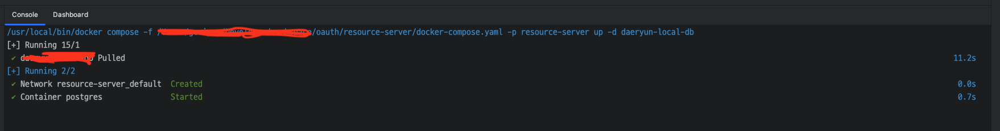
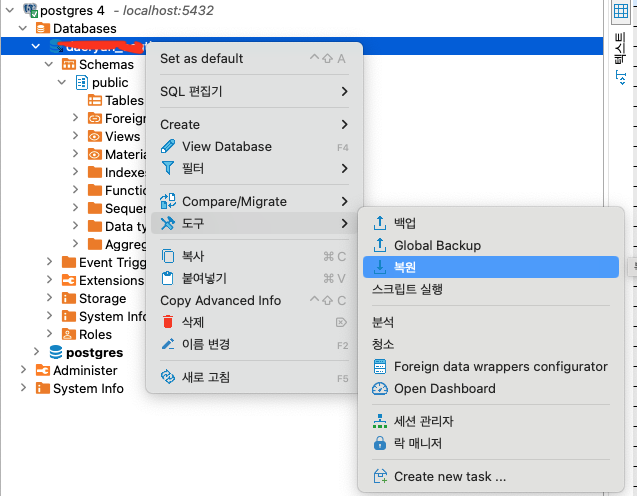
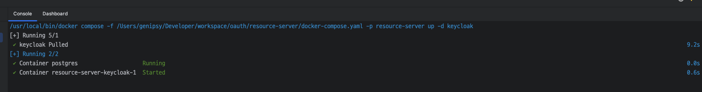
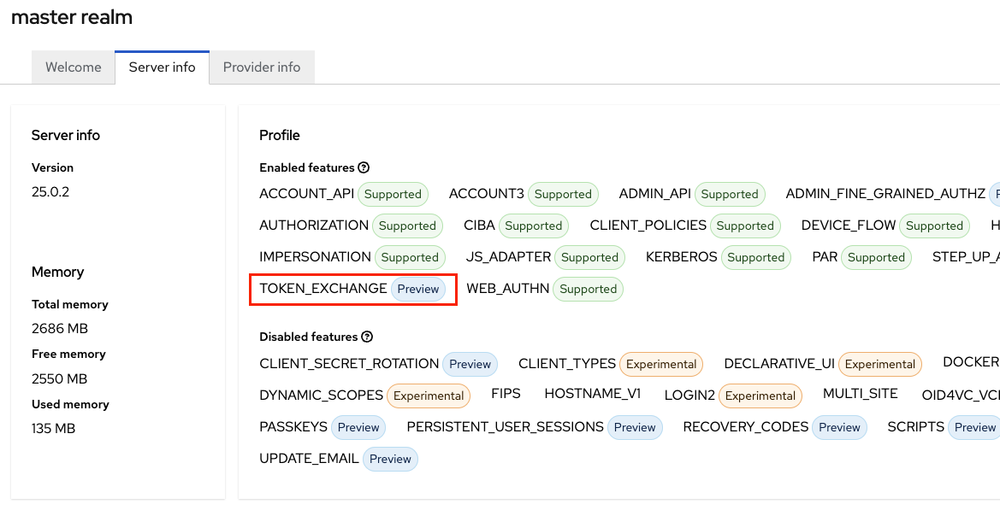

Daeryun OAuth
=============
## 1. 개요
1. 회원 가입을 하나로 하고자 하여 만들게 됨
2. 가입 -> 시스템별 사용동의 -> 사용

## 2. 시스템 구성
### 1. Authorization Server (Keycloak)
- 인증서버
- 시스템 등록 및 권한명 등록
- 사용자 등록 및 시스템(권한) 매핑
- token 발행 및 갱신
- 로그아웃 처리
- (docker를 이용한 개별 PC에서도 개발 및 테스트가 가능하게 설정할 예정)

### 2. Resource Server (Spring Boot)
- Authorization Server 에서 발급된 token을 사용하여 사용자의 접근권한을 확인 함
- 각 시스템과 인증서버 사이에서 권한 및 토큰의 유효성 등을 확인 함
- 실제 이 프로젝트에서 구현중인 내용임

### 3. Client
- 각각의 서비스 시스템
- 인증정보를 사용할 예정
- 즉 이 프로젝트에 존재하지 않고 Resource Server에서 인증 정보 및 권한을 확인하여 실제 서비스를 제공하는 시스템
  - 예) ${프로젝트명 나열} ... 등

## 3. 기능
### 1. 우선 1차로 계획한 기능은 다음과 같음
- 로그인, 로그아웃
- 토큰 검증 및 갱신
- 회원가입
- Client - User 매핑
- 탈퇴...도 해야하나~

### 2. 1차가 어느정도 마무리되면 그 뒤로 추가할 내용
- 일단 google 가입 추가

## 4. 로컬세팅방법
### 1. docker 설치
- 일단 이 PC에서는 docker-desktop을 설치했다
- docker-compose 도 설치한다
### 2. db 설치
- /resource-server/docker-compose.yml 파일 중 ${컨테이너명} 먼저 실행시킨다.
  
- DB GUI Tool(문서에서는 DBeaver)을 열어서 접속한다.
- db명(daeryun_oauth) 우클릭 -> 도구 -> 복원(restore) 클릭한다
  
- /files/sql/${SQL파일명} 파일을 열고 실행시킨다. 
- 끝나면 취소를 클릭한다. 
### 3. keycloak 설치
- /resource-server/docker-compose.yml 파일 중 keycloak을 실행시킨다.
  
- http://localhost:8080 을 접속하여 로그인을 한다. (로컬은 admin/admin)
- 로그인이 성공하면 설정 끝
- realm은 ${Realm명}이다 
- 이 다음부터는 마음껏 실행하면 된다

## 5. 소셜로그인 이슈 (일단 국내는 한방에 안된다...)
### 1. 공통
- 컨테이너를 띄울 시 exchange token 속성이 필요하다. 
  
- java option으로 아래와 같이 넣어준다(이거 찾는데만 2일 걸렸다)
~~~
  -Dkeycloak.profile.feature.admin_fine_grained_authz=enabled -Dkeycloak.profile.feature.token_exchange=enabled
~~~
### 2. 카카오
- userinfo url을 설정 시 웹 앱 전부 로그인인 안된다. 
- userinfo를 설정할때 resource server를 통해 id를 sub로 하나 더 넣어주도록 한다.
### 3. 네이버
- token url을 호출하면 일단 오류가 난다. 
- token을 받을 수 없다고 나오는데 이때 token은 id token이다. 
- 즉...token을 받는 부분 및 userinfo 둘다 확인해야 한다.
### 4. 애플
- 제길...애플은 accesstoken이 없다... 이것도 만들어 줘야하네...
- 애플은 key file을 이용해서 secret을 생성해야 한다. (보안을 위해서라면)이 부분도 주기적으로 갱신하도록 만들어줘야 한다. 
- scope를 email로 하려면 form_post로 해야 하는데 keycloak으로 바로 보내면 오류가 발생한다. 즉...gateway를 하나 만들어줘야한다. 근데...redirect uri에서 post 안받으면 우짜지...
- access token이 없는만큼 app에도 id token을 요청해야한다. 이거...안까먹게 꼭 메모메모.

### 5. Token Exchange 설정
- client를 추가하고 나면 Client scopes > setup 에 'token_exchange'를 추가한다.
- Client scopes > evaluate 에 scope_parameter에서 'openid'를 선택한다(그렇게 하고나면 idento_provider가 추가된다.)
- Service accounts roles 에서 'Assign role'버튼을 클릭한다.
  - 'realm-management'항목중 manage-clients, manage_users를 추가해준다.
  - Filter by clients를 클릭해서 Filter by realm roles 로 바꿔주면 token-exchange가 있다 그걸 추가해준다
- Permissions 탭에서 Permission enabled를 On으로 바꿔준다. 
- Advanced 탭에서 
  - Use refresh tokens, Use refresh tokens for client credentials grant 를 On으로 해준다.
- 여기서 끝난거 같지만 아직 하나가 남았다.
- Identity providers > 아무거나 하나 선택 > Permissions 탭에서
  - Permissions enabled 를 On으로 변경해준다
  - token-exchnge 상세로 들어가서 Policies의 client_token_exchange를 선택해서 추가한 client id 를 넣어준다.

## 6. 기타
- 미라레솔시미
- 내용 계속 추가예정
- 나 이거 어떻게 만들었지...
